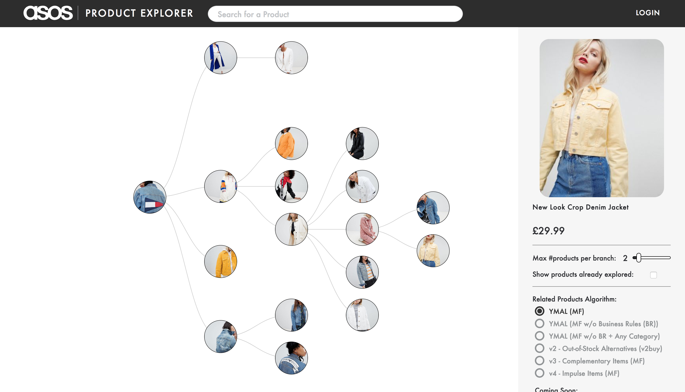

ASOS Product Explorer
===============

ASOS Product Explorer is a tool that helps you explore the ASOS catalogue and the relationships between products, while discovering new styles you might like to wear along the way!
Start from any product and quickly navigate through trees of related products.

The app pulls related product information from ASOS' Recommendation APIs. Have a look at the documentation at - (TBC)

Cloned from [Artist Explorer](https://github.com/fsahin/artist-explorer)

Running Locally
===============
Not necessary but strongly suggested:
Create a [virtualenv] (http://docs.python-guide.org/en/latest/dev/virtualenvs/) or use an existing one before installing dependencies of this project.

Need to set your bearer token for authentication in calling ASOS Recommendations APIs (bearerToken var in server.py)

ASOS API calls are proxied through a flask server. Need to start the server first:
```
cd server
pip install -r requirements.txt
python server.py
```

Also need to serve the (client-side) files at the root of the project. Change directory to the project base & execute the following command:
```
python -m http.server 9000
```

Can then seed product to explore from by using 0.0.0.0:9000/?product_id={ProductID you want to start from}

App
===


Consumed Libraries:
--------------
* [d3](http://d3js.org/)
* [Flask](http://flask.pocoo.org/)
* [Knockout](http://knockoutjs.com/)

